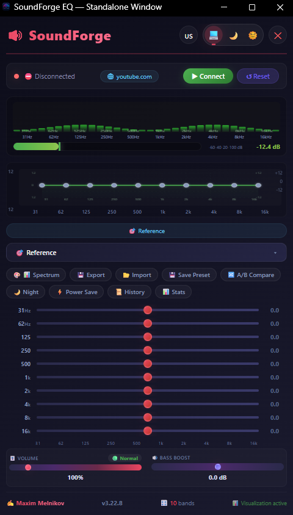
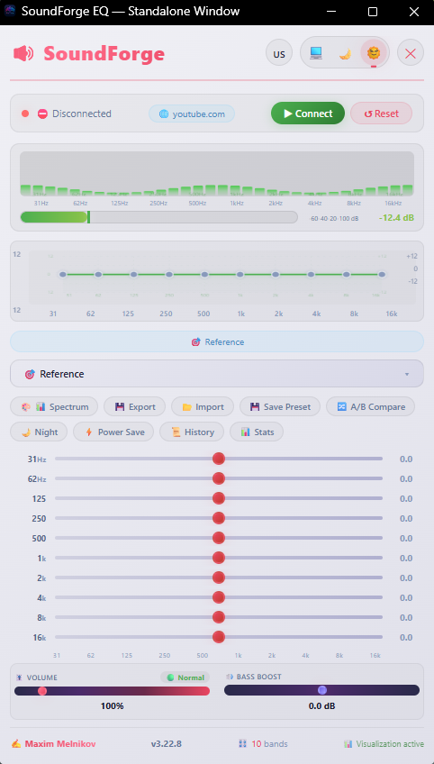

# 🎛️ SoundForge Equalizer

> Премиальное браузерное расширение с 10-полосным эквалайзером для всех сайтов

---

## ✨ Возможности

| Функция | Описание |
|---------|----------|
| 🎚️ **10-полосный эквалайзер** | 31 Гц – 16 кГц, ±12 дБ, шаг 0.5 дБ |
| 🎵 **50 профессиональных пресетов** | От Reference до MAX BOOST |
| 🔊 **Громкость 0-800%** | Полное отключение звука при 0% |
| 🎸 **Bass Boost** | ±12 дБ для глубокого баса |
| 🎨 **4 эффекта визуализации** | Спектр, Волны, Огонь, Неон |
| 📊 **VU-метр** | Индикация клиппинга в реальном времени |
| 🌙 **Ночной режим** | Автоматически с 22:00 до 07:00 |
| ⚡ **Энергосбережение** | Снижение частоты обновлений |
| 💾 **Экспорт/Импорт** | Настроек в JSON |
| 🌐 **Для каждого сайта** | Автосохранение настроек |
| 🔀 **A/B сравнение** | Сравнение пресетов |
| ⌨️ **Горячие клавиши** | Быстрое управление |

---

## 📸 Скриншоты

### Полный интерфейс

### Светлая тема

### Главное окно

---

## 🎯 Пресеты

### 🎵 Основные
- **Reference** — нейтральный звук
- **Natural** — естественный
- **Universal** — универсальный
- **Balanced** — сбалансированный

### 🎶 Электронные
- Club, Dance, EDM, Synthwave, Deep House, Festival

### 🎸 Рок/Метал
- Rock, Metal, Hard Rock, Grunge

### 🎤 Вокал/Подкасты
- Vocal, Podcast, Speech, Rap

### 🎻 Акустика/Классика
- Acoustic, Piano, Orchestra, Classical, Jazz

### 🎧 Специальные
- Headphones, Car, Night, Bass Boost, Hip-Hop, Soul, Blues, Reggae, Chill, Lo-Fi, Sunset, Pop, K-Pop, World, Ambient, Clarity

### 🌊 Wave/Phonk
- Wave, Phonk

### ⚡ MAX BOOST
- Logitech G321, MAX BOOST

### 🎮 Игры/Кино
- Gaming, Movie, FPS

### 🌟 Премиум
- Hi-Fi, Studio, Premium, Master

---

## ⌨️ Горячие клавиши

| Комбинация | Действие |
|------------|----------|
| `Ctrl+Shift+U` | Открыть расширение |
| `Ctrl+Shift+E` | Вкл/Выкл эквалайзер |
| `Ctrl+Shift+Y` | Следующий пресет |
| `Ctrl+Shift+X` | Сброс всех настроек |

---

## 🔧 Установка

### Для Microsoft Edge / Google Chrome

1. Скачайте папку **Microsoft Edge**
2. Откройте `edge://extensions/` или `chrome://extensions/`
3. Включите **Режим разработчика**
4. Нажмите **Загрузить распакованное расширение**
5. Выберите папку **Microsoft Edge**

### Для Firefox

1. Скачайте папку **Firefox**
2. Откройте `about:debugging`
3. Нажмите **Загрузить временное дополнение**
4. Выберите `manifest.json` из папки **Firefox**

---

## 📁 Структура проекта

SoundForge-Equalizer/
├── 📁 Microsoft Edge/ # Версия для Edge/Chrome (Manifest V3)
│ ├── background.js # Фоновый сервис-воркер
│ ├── inject.js # Внедряемый скрипт для аудио
│ ├── manifest.json # Манифест расширения
│ ├── popup.html # Основной интерфейс
│ ├── popup.js # Логика popup
│ ├── style.css # Стили (темная/светлая/системная)
│ ├── window.html # Отдельное окно
│ ├── window.js # Логика окна
│ ├── window.css # Стили окна
│ ├── 📁 features/ # Дополнительные функции
│ ├── 📁 icons/ # Иконки расширения
│ ├── 📁 modules/ # Модули (audio, config, i18n...)
│ └── 📁 screenshots/ # Скриншоты
├── 📁 Firefox/ # Версия для Firefox
│ ├── background.js
│ ├── inject.js
│ ├── manifest.json
│ ├── popup.html
│ ├── popup.js
│ ├── style.css
│ ├── window.html
│ ├── window.js
│ ├── window.css
│ ├── 📁 features/
│ ├── 📁 icons/
│ └── 📁 modules/
└── 📁 Screenshots/ # Общие скриншоты
├── Full Equalizer.png
├── soundforge-full-interfac.png
└── soundforge-light-ui.png

---

## 🛠️ Технологии

| Технология | Описание |
|------------|----------|
| **Manifest V3** | Современный стандарт расширений |
| **Web Audio API** | Обработка аудио |
| **Chrome Extensions API** | Работа с браузером |
| **CSS3** | Тёмная/светлая/системная темы |
| **JavaScript (ES Modules)** | Модульная архитектура |

---

## 📊 Статистика

- **10** полос эквалайзера
- **50** встроенных пресетов
- **4** эффекта визуализации
- **3** языка интерфейса (RU, UA, EN)
- **63** файла в репозитории
- **37 614** строк кода

---

## 🤝 Вклад в проект

1. Форкните репозиторий
2. Создайте ветку для вашей функции
3. Внесите изменения
4. Создайте Pull Request

---

## 📝 Лицензия

MIT License

---

## 👤 Автор

**Maxim Melnikov**

[GitHub](https://github.com/Maximka1993271)

---

## ⭐ Поддержка

Если вам понравилось расширение:
- Поставьте ⭐ звезду на GitHub
- Поделитесь с друзьями
- Сообщите об ошибках в Issues

---

> **SoundForge Equalizer v3.22.8** — Сделайте звук таким, каким он должен быть! 🎵
